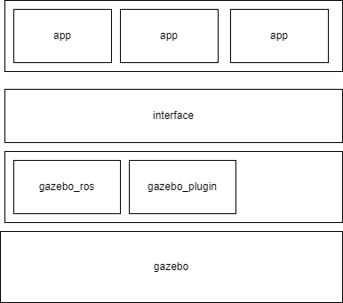

# 开发方案

## 1 功能简述

1. 在```start_pose```处生成货物，由调度控制器调度小车和机械臂将货物放上小车(位于```load_pose```)
2. 小车自主将货物运输到```end_pose```处(对于不同种类的货物，目的地是不同的，可能会设置2-3个目的地)
3. 当运抵目的地后，调度控制器调度机械臂完成货物卸载(卸载位置为```unload_pose```)，小车重新开始加入调度。
4. 小车实现自主电量管理，电量不足时及时充电，充电时小车不会被调度，充电位置为```charge_pose```

机械臂工作流程：move1 -> down1 -> grasp -> up1 -> move2 -> down2 -> release -> up2   

## 2 架构简述

项目架构主要分为interface层和app层，具有可扩展性高，耦合度低，便于开发等特点

- interface层通过```gazebo_ros```等包直接调用gazebo的服务
- app层通过调用interface的接口实现业务逻辑



## 3 数据流简述

项目通过事件传递数据，实现基本功能。

事件：由某个app发出，相关的app订阅以后对该事件进行处理。比如货物运达，小车电池耗尽等。

参数：事件发出时需要携带参数，传入处理该事件的app

app：处理事件的python脚本，注册事件的回调函数

### 3.1 参数

app触发事件时会传递参数，订阅该事件的app回调函数可以得到该参数。比如camera在触发good_appear事件以后，需要传递货物的id作为参数。而scheduler对该事件的响应需要获取到id这个参数。

#### 3.1.1 参数格式

为了开发方便，所有的参数类型定义为String，格式为```json```。例如下面是一条合法的消息：

```json
{
	"id": "001",
	"destination": 1
}
```

#### 3.1.2 参数构建

通过python的```dist```进行构建，并通过```json```包转为String。例如:

```python
msg = {"id": "001", "distination":1} 
msg = json.dumps(msg)
```

### 3.1.3 参数获取

通过```json```包将String转为```dist```，例如获取id

```python
msg = json.loads(msg)
id = msg["id"] # 在构建消息时也可以使用 msg["id"] = id 进行构建
```

### 3.2 事件

#### 3.2.1 cargo_appear

货物在```start_pose```出现事件(可能是摄像机捕捉到)

发布者：摄像机或者环境管理器

订阅者：scheduler

参数格式：

- id: string, 表示货物的id
- destination: int, 表示货物的目的地。货物的目的地可能有2-3个，这里给出的是目的地索引。
- start_point: int, 目前填0 

消息例子:

```json
{
	"id": "001",
    "destination": 1,
    "start_point": 0,
}
```

#### 3.2.2 schedule_done

scheduler完成了调度，确定了哪一辆小车运送

发布者：scheduler

订阅者：小车, arm

参数格式：

- car_id: string, 表示小车id
- cargo_id: string, 表示货物id
- arm_id: string, 在目的地参与搬运的机械臂
- destination: int, 目的地索引

消息例子:

```json
{
	"car_id": "001",
    "arm_id": "002",
    "cargo_id": "001",
    "destination": 1,
}
```

#### 3.2.3 car_arrive

小车到达start_pose或者end_pose，此时机械臂需要从小车上卸载或者装载货物。如果机械臂已经运动到指定地点，则直接进入down1，否则需要等待move1完成

发布者：小车

订阅者：arm

参数格式：

- arm_id: string, 表示要求运动的机械臂

消息例子:

```json
{
	"arm_id": "001",
}
```


#### 3.2.4 charge_require

小车需要充电，此时调度器不再调度小车

发布者：小车

订阅者：scheduler

参数格式：

- car_id: string, 表示小车id

消息例子:

```json
{
	"car_id": "001",
}
```

#### 3.2.5 charge_done

小车充电完成，此时小车重新加入调度 

发布者：小车

订阅者：scheduler

参数格式：

- car_id: string, 表示小车id

消息例子:

```json
{
	"car_id": "001",
}
```

#### 3.2.5 unload_done

机械臂抓起货物上升，此时卸载货物的小车可以离开进入等待区，或者运送下一个货物

发布者：arm

订阅者：小车, scheduler

参数格式：

- arm_id: string, 表示机械臂id

消息例子:

```json
{
	"arm_id": "001",
}
```

#### 3.2.5 load_done

机械臂空载上升，此时装载货物的小车可以离开```start_pose```

发布者：arm

订阅者：小车, scheduler

参数格式：

- arm_id: string, 表示机械臂id

消息例子:

```json
{
	"arm_id": "001",
}
```

### 3.3 app

#### 3.3.1 全局数据

该数据视为已知数据

- 配置了目的地信息

```python
[
    {"arm_id": string, "position": Pose},
]
```

- 出发点信息:  

```python
[
	{"arm_id": string, "position": Pose}
]
```

#### 3.3.2 car_app

状态：

- run: 正在运输中
- wait: 等待装载或者充电
- ready: 在空闲区等待

可能需要记录的数据:

- 货物id
- car id
- 与其协作的机械臂id
- 出发点和目的地，要求记录索引。准确的地址需要查表。

#### 3.3.3 arm_app

状态:

- move1: 移动到装载的位置
- down1: 放下机械臂
- grasp: 夹具抓紧
- up1: 升起机械臂
- move2: 移动到卸载位置
- down2: 放下机械臂
- release: 夹具松开
- up2: 升起机械臂

可能需要记录的数据：

- 自身id

#### 3.3.4 scheduler_app

可能需要记录的数据:

- 所有机械臂的状态
- 所有小车的状态，是否是ready
- 所有task状态，包括该次运输任务的小车，目的地，是否完成等等

## interface 描述

### 1 ```ArmInterface```

构造函数:

```python
def __init__(self, controller_name, robot_name, robot_pose, r1_pose, r2_pose):
        """
        创建scara控制器

        Input:  controller_name - 控制器节点名称
                robot_name - 控制器对应的机械臂名称
                robot_pose - scara机械臂所在位置
                r1_pose    - rotation1的初始位置
                r2_pose    - rotation2的初始位置    
        """
```

|class method       |description|
|-                  |-|
|```move_to(pose)```|move the gripper to the given pose|
|```move_up()```    |move the gripper up|
|```move_down()```  |move the gripper down|
|```grasp()```      |grasp the gripper|
|```release()```    |release the gripper|
|```update()```     |update joint position and velocity, should be called in main  loop |

举个例子，比如说我需要开发arm的app，那么首先继承```ArmInterface```，然后在对应的事件中添加回调函数。比如arm需要在schedule_done的时候移动到start_pose，那么需要实现这个函数。具体如何移动，需要调用```self.move_to(pose)```

```python
#! /usr/bin/env python
# -*- coding: utf-8 -*

import rospy
import json
from scara_interface import ScaraInterface
from geometry_msgs.msg import Pose, Point
from std_msgs.msg import String
from enum import IntEnum

config = {
    "001": {"robot_pose": Pose(), "r1_pose": Pose(), "r2_pose": Pose()}
}

class App(ScaraInterface):
    def __init__(self, controller_name, robot_name):

        ScaraInterface.__init__(controller_name, robot_name, robot_pose, r1_pose, r2_pose)
        self.publisher = rospy.Publisher("load_done", String)
        
    def schedule_done(self, data):
        """
        定义回调函数, 在schedule_done的时候调用 
        """
        data = json.loads(data)
        if data["arm_id"] != self.robot_name:
            return
		# 机械臂搬运
        # ...
        # 发布一条信息，表示机械臂完成了搬运
        msg = {"arm_id": self.robot_name}
        msg = json.dumps(msg)
        self.publisher.publish(msg)
        
if __name__ == "__main__":
    app = App("controller", "scara_robot1")
    rospy.Subscriber("schedule_done", String, app.schedule_done)
    rospy.spin() # 这里是阻塞函数，等待callback被调用
```

更加具体的如何发布事件(就是topic)和注册事件的回调函数可以看：[https://blog.csdn.net/zlb_zlb/article/details/103444360](https://blog.csdn.net/zlb_zlb/article/details/103444360)

